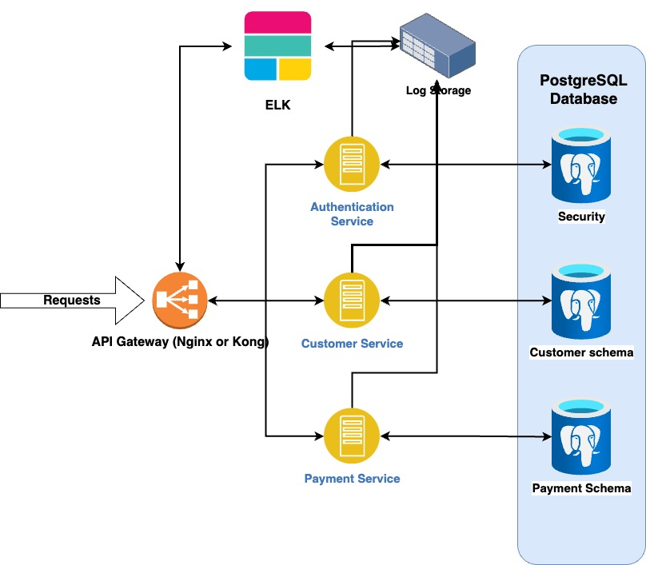

# Banking Application Assignment for Backend Developer Interview

This is a simple banking backend application written in Java, designed to provide basic functionalities for managing customer accounts. The application supports customer creation, balance management, and transaction processing through either a Rest API or a basic GUI. The application is built with microservice architecture principles and stores data securely in a relational database (PostgreSQL).

Here is requirements
Please write a Small Banking Backend Application with the below functionalities
• Create a customer with fields Name, Surname, Birth Date, GSM Number, and Balance.
• The initial customer balance should start with 100 azn.
• Customers can make top-up money, purchase, and refund transactions via Rest API or basic GUI.
• Create database and store data in a database (Oracle, PostgreSQL, MySQL).
• The communication channel must be secure.
• The solution must be written in Java language and compatible with microservice architecture.
Please don't:
• Create a fancy UI.
• Images are not important.
Demonstration Steps:
• Top-up 15 azn to Customer balance.
• Purchase 10 azn from Customer balance.
• Refund 5 of 15 azn from the last purchase transaction.

Architecture

Technology Stack:
• Java language.
• Spring Boot framework.
• Spring Data JPA.
• Swagger for API documentation.
• JWT for authentication services.
• Microservice architecture.
• PostgreSQL for database
• Docker
• To create API documentation in JavaDoc you can run this command for each service : mvn javadoc:javadoc